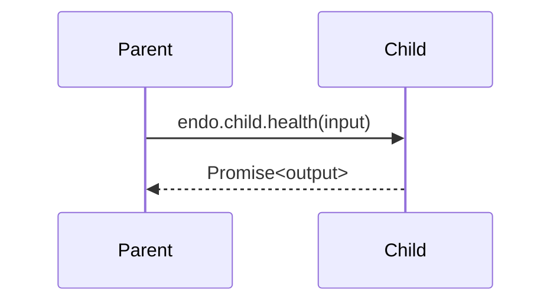
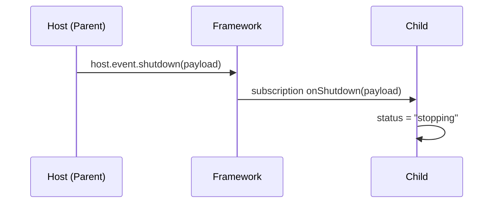
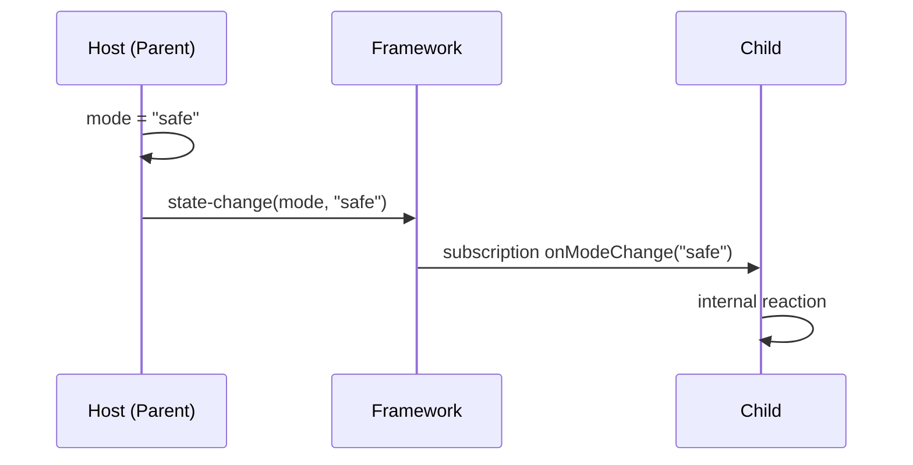
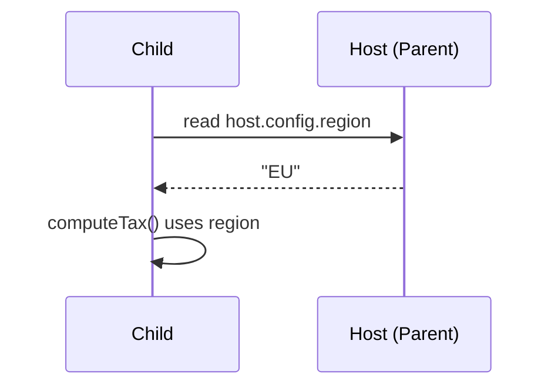

# Strictness Guarantees
This model is designed to prevent accidental coupling:

*   **No reach-through state:** Parent cannot read/write child state; child cannot read/write host state.
*   **No cross-layer event calls:** Events are local only.
*   **No upward queries:** Child cannot query host.
*   **Controlled downward queries:** Parent may query children explicitly.
*   **Subscriptions are explicit and type-checked:** Child reacts to host sources via declared mappings, not by shared names.

## About Feedback Loops
The framework prevents accidental cross-layer loops by restricting surfaces. However, users can still create deliberate loops, e.g.:

1.  Host event triggers child subscription.
2.  Child handler emits a self-event that ultimately triggers a host event again (through user-managed wiring).

This is intentionally allowed: the system favors explicitness over hidden “magic loop prevention.”

> **Guideline:** Use **Events** for one-way notifications and **Queries** for request/response. Prefer **Subscriptions** for host → child reactions rather than calling into child state.

## Design Rationale (Short)
*   **Config** is safe to read across layers because it is immutable.
*   **State** is private to preserve encapsulation and refactorability.
*   **Events** are local to prevent cascade-style coupling.
*   **Queries** are allowed downward for orchestration (parent coordinates children), but disallowed upward to prevent “stacking awaits” across layers.
*   **Subscriptions** provide explicit, typed host → child reactivity without exposing callable cross-layer functions.

---

# Examples

These examples are intentionally small and focus on *the model*, not specific syntax details.

### Example A — Parent queries a child (downward Query)

**Goal:** The parent orchestrates work by calling a child Query. The parent cannot read child State and cannot call child Events.

#### DNA sketch
*   **Parent**
    *   `Config`: `appName`
    *   `Query`: `getChildHealth`
*   **Child**
    *   `Query`: `health`
    *   `State`: `status` (local only)

#### Flow
1.  Parent calls `endo.child.health(...)` (Query).
2.  Child returns a `Promise<Health>`.
3.  Parent continues with the result.

**What’s not possible (by design):**
*   Parent cannot do `endo.child.status` (child State is not readable).
*   Parent cannot do `endo.child.someEvent(...)` (child Events are not callable cross-layer).

---

### Example B — Child reacts to host Event via Subscription

**Goal:** The child reacts to a parent Event (host emits an event, child subscription runs). The child does not call host Event directly; it only receives notifications through the subscription mechanism.

#### DNA sketch
*   **Parent**
    *   `Event`: `shutdown`
*   **Child**
    *   `Subscription`: `onShutdown` subscribing to `host.event.shutdown`
    *   `State`: `status`

#### Flow
1.  Host fires `shutdown(payload)`.
2.  Framework dispatches to all children with Subscriptions bound to that event.
3.  Child’s `onShutdown(payload)` handler runs.
4.  Child updates its own state (`status = "stopping"`) locally.

**What’s not possible (by design):**
*   Child cannot call `host.shutdown(...)` directly (host Events not callable).
*   Child cannot mutate host State.

---

### Example C — Child reacts to host State changes via Subscription

**Goal:** Subscriptions can target host State changes as well as Events.

#### DNA sketch
*   **Parent**
    *   `State`: `mode`
*   **Child**
    *   `Subscription`: `onModeChange` subscribing to `host.state.mode`

#### Flow
1.  Host changes its state: `mode = "safe"`.
2.  Framework detects the change and invokes subscriptions bound to that state locus.
3.  Child reacts.

**Notes:**
*   The child still cannot read host State directly. It only receives the new value through the subscription handler.
*   This ensures a single, explicit dependency point: the subscription definition.

---

### Example D — Config is readable downward

**Goal:** Child can read host Config (immutable) for contextual behavior without coupling to host State.

#### DNA sketch
*   **Parent**
    *   `Config`: `region`
*   **Child**
    *   `Query`: `computeTax`

#### Flow
1.  Parent’s config `region` is readable by the child as `host.config.region`.

**What’s not possible (by design):**
*   Parent cannot read child config/state (no upward reads).
*   Child cannot write host config (immutable) or host state.

---

# Practical Guidelines

*   **Use State** for local values you want to observe/react to within a cell.
*   **Use Events** for local “fire-and-forget” actions inside the same cell boundary.
*   **Use Queries** for explicit request/response, especially parent → child orchestration.
*   **Use Subscriptions** for host → child reactivity (events or state changes) with explicit mapping.
*   **Use Config** for immutable, environment-like values that children may need.